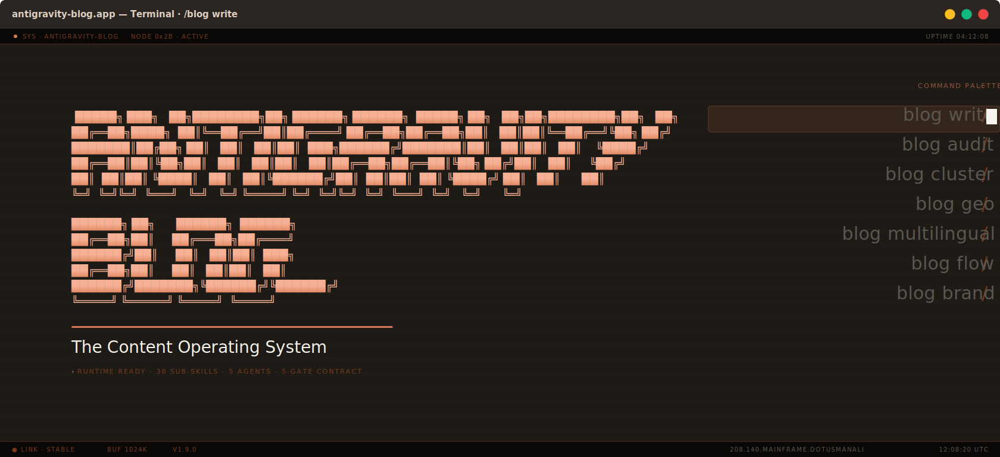
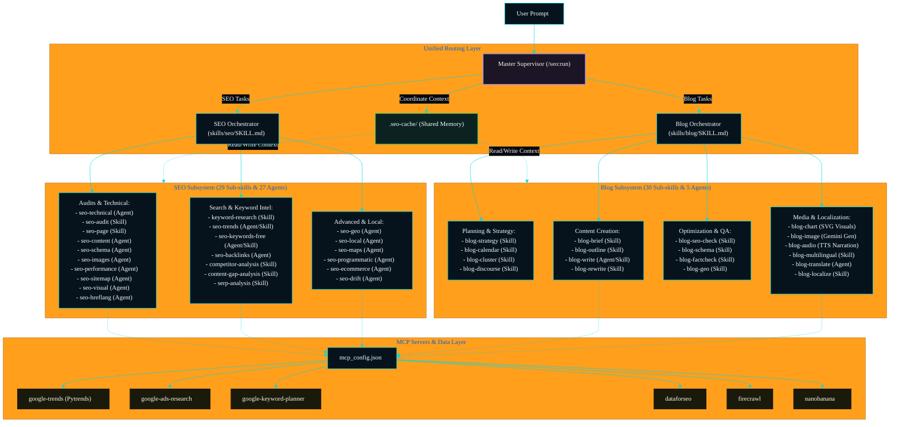

<p align="center">
  
</p>

# Antigravity SEO & Blog Suite — Complete SEO & Content Ecosystem

A production-grade, state-of-the-art SEO analysis and automated blog creation ecosystem built natively for the **Antigravity** developer platform. 

This suite bridges deep-dive search intelligence with automated editorial workflows. It combines determinism (via local Python runners) with real-time scraping and official APIs (via MCP) to deliver expert-level audits, keyword research, core visual charts, and publish-ready content.

[](skills/)
[](agents/)
[](pyproject.toml)
[](LICENSE)

---

## 1. System Architecture & Subsystems

The suite is modular, dividing complexity across three key architectural layers:



### The Three Core Engines:
1. **SEO Router (`skills/seo/SKILL.md`)**:
   * Coordinates 29 sub-skills and 27 agent profiles. Performs single-page or site-wide analysis including Core Web Vitals (INP-focused), schema verification, authority audits, competitor gap analyses, and local map-pack checks.
2. **Blog Router (`skills/blog/SKILL.md`)**:
   * Coordinates 30 sub-skills, 12 content templates, and 5 specialized agents. Handles editorial calendars, outlines, EEAT assessments, translation/localization, and article drafts.
3. **Master Supervisor (`/seo:run`)**:
   * The top-level coordinator that bridges the SEO and Blog repositories. It reads multi-step prompts (e.g., *"Find trends and write a draft"*), plans the roadmap, verifies cache validation (Fix 3), evaluates outputs via a lightweight check (Fix 2), and executes loop logic safely (cap: 5 iterations).

---

## 2. Command Namespace Reference

All capabilities are exposed via the `/seo:` namespace to keep prompts simple and structured:

| Command | Arguments | Purpose / Workflow |
|---|---|---|
| `/seo:run` | `<complex-goal> [--max-steps <int>] [--force-fresh]` | **Master Supervisor**: Bridges SEO and Blog systems. Generates an Execution Roadmap, runs structural reviews, checks cache TTL, and halts on safety limits. |
| `/seo:auto` | `<goal> [--deep]` | **Intent Inference**: Runs local routing to check standard SEO scenario families (Audit, Research, Write, Track) and triggers standard gates. |
| `/seo:research`| `<domain-or-topic> [--competitors <domains>] [--map]` | **Market Intel**: Identifies search queries, competitor ratings, SERP intent, content gaps, and semantic architectures. |
| `/seo:audit` | `<target> [--full] [--tech\|--visibility\|--authority]` | **Deep Audit**: Analyzes Core Web Vitals, Schema.org health, E-E-A-T score, and AI visibility (GEO) rankings. |
| `/seo:create` | `<keyword> [--brief\|--series\|--refresh\|--meta\|--schema]` | **Content Engine**: Generates briefs, writes posts, applies HTML schema structures, and designs meta tags. |
| `/seo:track` | `<url> [--alert\|--report\|--remember]` | **Metrics Tracking**: Monitors SERP shifts, alerts on performance baseline drifts, and updates campaign memories. |

---

## 3. Visual Charts Engine (`blog-chart`)

The suite features a built-in SVG Data Visualization Engine (`skills/blog-chart`) that automatically designs dark-mode-compatible inline charts for blog posts and audit reports.

### Supported Visualization Types:
* **Horizontal Bar Chart**: Percentage changes and direct factor comparisons.
* **Grouped Bar Chart**: Before/after comparisons and dual-series metrics.
* **Donut Chart**: Share of voice, market share, and parts-of-a-whole.
* **Line Chart**: Keyword popularity and search trend lines over time.
* **Lollipop Chart**: Ranked opportunities and correlation values.
* **Area Chart**: Cumulative data distributions and ranges.
* **Radar Chart**: Multi-dimensional parameter scores (e.g. Core E-E-A-T categories).

### Strict Styling Constraints:
To ensure accessibility and contrast compatibility across both dark and light reader modes, the visual charts conform to the following strict rules:
1. **Background**: Always transparent (no root SVG fill).
2. **Colors**: Approved color palette tokens only:
   * 🟠 Primary: `#f97316` (Orange)
   * 🔵 Secondary: `#38bdf8` (Sky Blue)
   * 🟣 Tertiary: `#a78bfa` (Purple)
   * 🟢 Indicator: `#22c55e` (Green)
3. **Accessibility**: All charts output accessible markup using `role="img"`, descriptive `aria-label`, `<title>`, and `<desc>` fields, and attribute sources at the bottom center.
4. **CurrentColor**: Text, grid lines, and labels use `currentColor` to dynamically adapt to the user's theme.

---

## 4. Shared Data Cache (`.seo-cache/`)

The `.seo-cache/` folder functions as the local memory of your assistant, avoiding repetitive paid API requests and token wastage.

### Key Naming Convention:
All cached files are structured as follows:
```text
{domain-or-topic-slug}__{task-type}__{YYYY-MM-DD}.json
```
* *Example*: `forexguru-pk__dr__2026-06-19.json` (Stores competitor Domain Rating)
* *Example*: `forex-trading-signals__trends__2026-06-19.json` (Stores Google Trends)

### 7-Day TTL Staleness Rule:
* Before running any keyword or authority fetch, the Supervisor checks if a cache key exists for the target.
* If a file exists and is **less than 7 days old**, the Supervisor reuses the cached file to save API quotas and token volume.
* You can bypass this check and force a fresh run by passing the `--force-fresh` flag (e.g. `/seo:run "..." --force-fresh`).

---

## 5. MCP Configurations and Setup

To enrich audits with real-world live data, configure your extensions inside `mcp_config.json`. The following 7 servers are natively supported:

| MCP Server Name | Source / Command | Purpose | Required Env Variables |
|---|---|---|---|
| `google-trends` | `python` (Local Clone: `GoogleTrendsMCP`) | Free historical and regional search trend metrics without API keys. | *None* |
| `google-ads-research` | `npx -y google-ads-mcp` | Fast Google autocomplete suggest phrases and lightweight trend indexes. | *None* |
| `google-keyword-planner` | `npx -y google-keyword-planner-mcp` | Search volume, advertiser competition levels, and average CPC. | `GOOGLE_ADS_DEVELOPER_TOKEN`, `GOOGLE_ADS_CLIENT_ID`, `GOOGLE_ADS_CLIENT_SECRET`, `GOOGLE_ADS_REFRESH_TOKEN`, `GOOGLE_ADS_LOGIN_CUSTOMER_ID` |
| `dataforseo` | `npx -y dataforseo-mcp-server` | Professional live SERPs, organic difficulty scores, and merchant product indexes. | `DATAFORSEO_LOGIN`, `DATAFORSEO_PASSWORD` |
| `firecrawl` | `npx -y firecrawl-mcp-server` | Site-wide JS-rendered crawling and automated XML sitemap mappings. | `FIRECRAWL_API_KEY` |
| `nanobanana` | `npx -y nanobanana-mcp` | Capturing above-the-fold visual layouts, mobile testing, and screenshot analysis. | `GOOGLE_AI_API_KEY` |

### Setting Up Local Google Trends MCP:
```bash
# 1. Clone the repository
git clone https://github.com/cryptoken/GoogleTrendsMCP.git G:\skills\GoogleTrendsMCP

# 2. Create virtual environment
cd G:\skills\GoogleTrendsMCP
python -m venv venv

# 3. Install requirements
venv\Scripts\pip install -r requirements.txt
```
The workspace `mcp_config.json` is pre-configured to execute this server via your local clone.

---

## 6. Premium Reports & PDFs

When executing audits or visual analysis, you can generate client-ready PDF deliverables containing Lighthouse graphs, Core Web Vitals gauges, and visual checklist charts:

1. Execute the audit:
   ```bash
   /seo:audit https://example.com --full
   ```
2. Request a premium document:
   ```text
   Generate a client-ready report for this run
   ```
   *The system invokes `scripts/google_report.py` and creates a styled HTML baseline report, compiles the visual SVG charts, and compiles the final PDF deliverable under the `pdf/` or `output/` directory.*

---

## 7. Development & Verification

### Initializing the Plugin:
To link and register this suite inside the Antigravity ecosystem:
```bash
# Register the local directory as an active plugin
agy plugin install /path/to/antigravity-seo
```

### Validation Check:
Always run the validation tool after editing skills or agent profiles to verify schema compliance:
```bash
agy plugin validate /path/to/antigravity-seo
```

### Authorship Rules (Workspace Compliance):
All contributions, wrappers, configurations, and document edits MUST obey the Personal Ownership Mapping rules:
* **Owner/Author**: `dotusmanali`
* **Email**: `dotusmanali@gmail.com`
* **Repository**: `https://github.com/dotusmanali/antigravity-seo`
* **Command Namespace**: Explicitly scoped inside the `/seo:` namespace.
