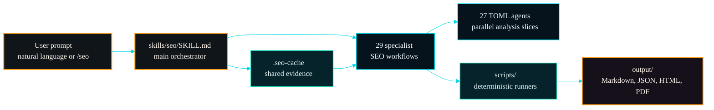
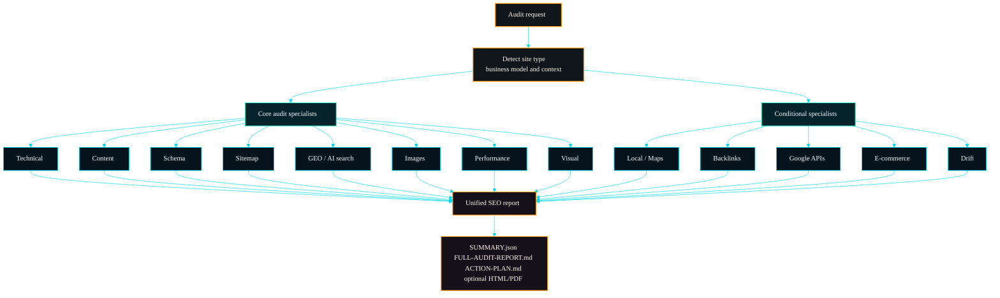
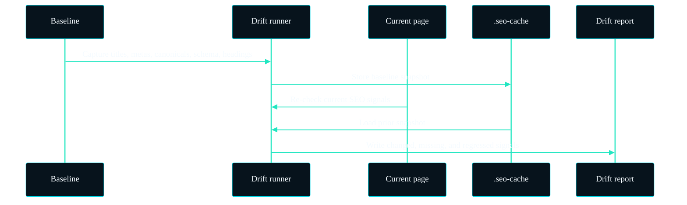
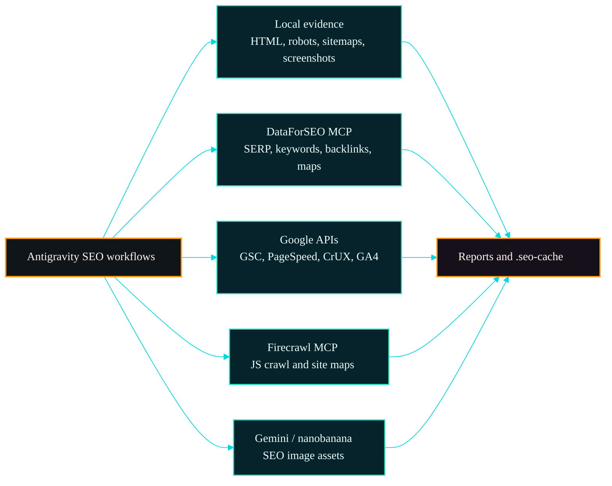
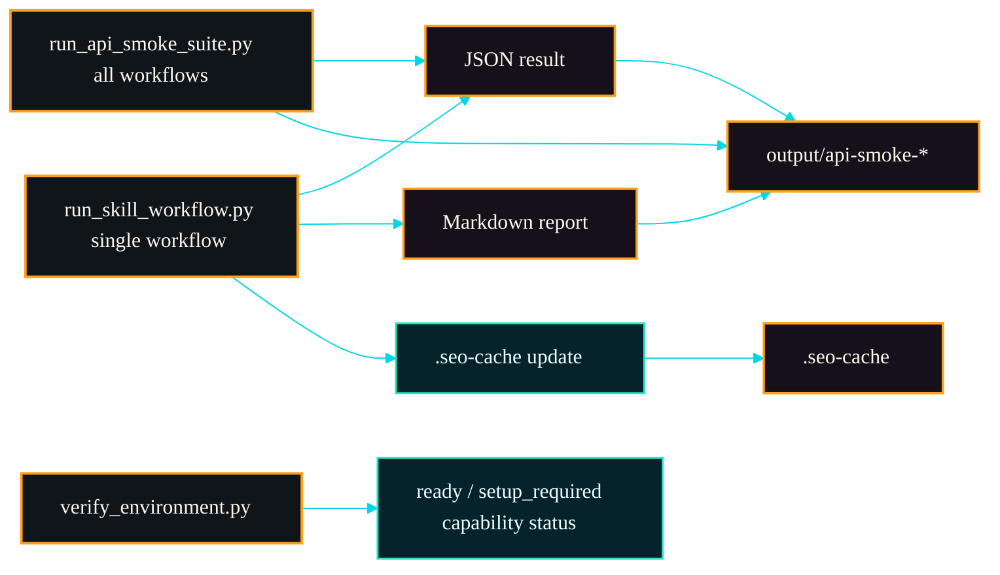
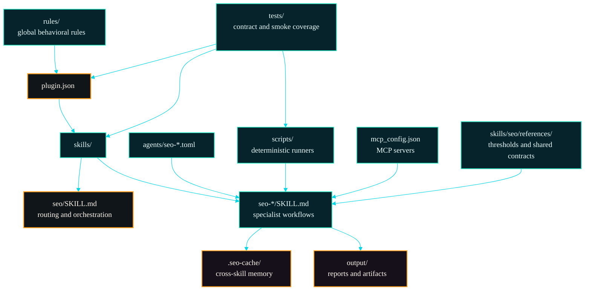

<p align="center">
  
</p>

# Antigravity SEO & Blog Suite — Complete SEO & Content Ecosystem for Antigravity

A complete, production-grade SEO analysis and blog creation ecosystem built for **Antigravity** (IDE, CLI, 2.0). Features 2 orchestrators, 60 specialist workflows, 32 AI agent profiles, 3 global rules, MCP integrations, shared cache artifacts, and deterministic headless runners.

[](LICENSE)
[](https://github.com/dotusmanali/antigravity-seo/releases)
[](pyproject.toml)
[](docs/COMMANDS.md)
[](agents/)

## Contents

- [Status](#status)
- [Install](#install)
- [Quick Start](#quick-start)
- [Visual Overview](#visual-overview)
- [Commands](#commands)
- [Features](#features)
- [Extensions](#extensions)
- [Headless/API Usage](#headlessapi-usage)
- [Architecture](#architecture)
- [Verification](#verification)
- [Requirements](#requirements)
- [Credentials And Cache](#credentials-and-cache)
- [Security](#security)
- [Uninstall](#uninstall)
- [Contributing](#contributing)
- [Related Projects](#related-projects)
- [Credits](#credits)
- [Attribution](#attribution)

## Status

- Repository visibility: public.
- Current release: [`v1.9.6-antigravity.5`](https://github.com/dotusmanali/antigravity-seo/releases/tag/v1.9.6-antigravity.5).
- Installer default ref: `v1.9.6-antigravity.5`.
- Latest local validation: 52 tests passing, full installed smoke suite passing, demo readiness passing.
- Runtime credentials stay outside the repo under Antigravity/local config paths.
- Discovery topics: `antigravity`, `antigravity-cli`, `antigravity-skills`, `seo`, `ai-seo`, `ai-search`, `technical-seo`, `generative-engine-optimization`, `core-web-vitals`, `schema-markup`, `local-seo`, `ecommerce-seo`, `content-strategy`, `google-search-console`, `dataforseo`, `mcp`, `python`, `automation`, `marketing-automation`, `open-source`.

## Install

### Option 1: Via Antigravity CLI

```bash
agy plugin install /path/to/antigravity-seo
```

### Option 2: Manual Copy

```bash
# 1. Clone the repository
git clone https://github.com/dotusmanali/antigravity-seo.git

# 2. Link as plugin
# Linux/macOS
ln -s /path/to/antigravity-seo ~/.gemini/config/plugins/antigravity-seo

# Windows (PowerShell as Admin)
New-Item -ItemType Junction -Path "$env:USERPROFILE\.gemini\config\plugins\antigravity-seo" -Target "C:\path\to\antigravity-seo"
```

### 3. Install Python dependencies

```bash
pip install -r requirements.txt
```

Restart Antigravity. All 60 skills and 32 agents are auto-discovered.

## Quick Start

Restart Antigravity after installation. Then ask naturally; a `/seo` command is not required:

```text
Do a full SEO check on https://example.com following best practices.
```

```text
Review this page for schema, Core Web Vitals, image SEO, and AI search readiness.
```

```text
Create an SEO strategy and content roadmap for a local dental clinic.
```

Command-style prompts also work:

```text
/seo audit https://example.com
/seo technical https://example.com
/seo schema https://example.com
/seo dataforseo serp "best seo tools"
```

## Visual Overview

Antigravity SEO is designed as a Antigravity-first routing layer: the user can ask naturally, the orchestrator selects the right specialist workflow, and deterministic runners write repeatable artifacts instead of relying on invisible chat-only output.



## Commands

The ecosystem features five one-shot mode commands under the **`/seo:`** namespace to orchestrate specific SEO and GEO intents:

| Command | Arguments | Purpose |
|---|---|---|
| `/seo:auto` | `<goal> [--deep]` | Infer SEO/GEO intent and run the smallest useful workflow. Add `--deep` for exhaustive, phase-gated execution. |
| `/seo:research` | `<domain-or-keyword>` | Analyze keyword demand, SERP intent, competitors, content gaps, and entity maps. |
| `/seo:create` | `<keyword> [--brief\|--series\|--refresh\|--publish\|--meta\|--schema]` | Generate content briefs, write/refresh posts, create series, and export CMS-neutral publish packages. |
| `/seo:audit` | `<target> [--full] [--tech\|--visibility\|--authority]` | Evaluate page SEO + CORE-EEAT quality, technical health (`--tech`), AI citation readiness (`--visibility`), and domain trust (`--authority`). |
| `/seo:track` | `<url> [--alert\|--report\|--remember]` | Track rank positions, trigger alerts (`--alert`), generate reports (`--report`), and update campaign memory (`--remember`). |

For individual workflow details and instructions, check the files directly under the `skills/` directory.

## Features

### Full Audit Pipeline

- Detects site/business type.
- Runs technical, content, schema, sitemap, performance, visual, GEO, image, and on-page analysis.
- Adds conditional specialists for local, maps, Google APIs, backlinks, clusters, SXO, drift, and e-commerce.
- Writes markdown reports, JSON summaries, cache artifacts, and optional premium HTML/PDF output.



### Technical SEO

- Robots.txt, sitemap discovery, canonical checks, indexability, URL hygiene.
- Security headers, JavaScript rendering risk, mobile basics, IndexNow.
- Core Web Vitals with INP, LCP, CLS, FCP, TTFB, and PageSpeed/CrUX integrations where available.

### Content, GEO, And SXO

- E-E-A-T and helpful content signals.
- AI citation readiness, answer-first formatting, entity clarity, llms.txt support.
- Search experience analysis: page type, user stories, persona fit, intent mismatch.

### Structured Data

- JSON-LD extraction and validation.
- Schema recommendations for Organization, LocalBusiness, Product, Article, FAQ, Breadcrumb, and related types.
- Generated schema artifacts for downstream use.

### Local, Maps, And E-Commerce SEO

- Local SEO signals, GBP readiness, citations, reviews, NAP consistency.
- Maps intelligence via free sources and DataForSEO when configured.
- Product schema, marketplace endpoints, merchant visibility, and e-commerce template checks.

### Drift Monitoring

- Capture SEO-critical baselines.
- Compare deployments or page changes.
- Track title, meta, headings, canonical, schema, robots, links, and content deltas.



### Deterministic Runners

- `scripts/run_skill_workflow.py` standardizes output for every user-invokable workflow.
- `scripts/run_api_smoke_suite.py` runs all supported workflows in one pass.
- Setup-required workflows return structured fallback results instead of pretending live data exists.

## Extensions

| Extension | Skill | Setup | Notes |
|---|---|---|---|
| DataForSEO | `seo-dataforseo`, `seo-maps`, `seo-ecommerce`, `seo-cluster` | Set `DATAFORSEO_LOGIN`/`DATAFORSEO_PASSWORD` env vars (configured in `mcp_config.json`) | Live SERP, keyword, backlinks, on-page, content, business data, AI visibility |
| Google APIs | `seo-google`, `seo-performance` | `python scripts/google_auth.py --setup` | PageSpeed, CrUX, GSC, URL Inspection, Indexing API, GA4 |
| Firecrawl | `seo-firecrawl` | Set `FIRECRAWL_API_KEY` env var (configured in `mcp_config.json`) | JS-rendered crawl, scrape, site map |
| Banana / Gemini | `seo-image-gen` | Set `GOOGLE_AI_API_KEY` env var (configured in `mcp_config.json`) | AI image generation through `nanobanana-mcp` |

Optional integrations enrich the same workflow surface. If credentials or MCP servers are missing, wrappers return `setup_required` or `mcp_configured` states with no fabricated live data.



Demo readiness:

```bash
python scripts/demo_readiness.py --target https://example.com --live-apis --workflows --json
```

One low-depth DataForSEO proof:

```bash
python scripts/demo_readiness.py --target https://example.com --live-apis --live-serp --serp-keyword "seo tools" --json
```

## Headless/API Usage

Run a single workflow:

```bash
python scripts/run_skill_workflow.py --skill seo-technical https://example.com --json
python scripts/run_skill_workflow.py --skill seo-google https://example.com --json
python scripts/run_skill_workflow.py --skill seo-dataforseo https://example.com --json
```

Run the full smoke suite:

```bash
python scripts/run_api_smoke_suite.py https://example.com --json
```

Verify environment:

```bash
python scripts/verify_environment.py --target https://example.com --json
```

Bootstrap a clean runtime:

```bash
python scripts/bootstrap_environment.py --venv .venv --json
```

Artifacts are written to `output/`. Shared project cache is written to `.seo-cache/`. Both are ignored by git.



## Architecture

The repository separates Antigravity-facing instructions, deterministic runtime code, optional provider setup, and validation contracts. That keeps the skill system usable in chat, installable as a suite, and testable from CI/API workflows.



```text
antigravity-seo/
├── plugin.json                       # Antigravity plugin manifest
├── hooks.json                        # Event hooks (PostToolUse)
├── mcp_config.json                   # MCP server definitions
├── requirements.txt                  # Python dependencies
├── pyproject.toml                    # Python project configuration
├── skills/
│   ├── seo/SKILL.md                  # SEO orchestrator
│   ├── blog/SKILL.md                 # Blog orchestrator
│   ├── references/                   # Shared contracts and frameworks
│   ├── memory/                       # Local campaign memory and caches
│   └── ...                           # 75+ flat auto-discovered skills
├── agents/                           # 29 Antigravity TOML agent profiles
├── rules/                            # Global behavioral rules
├── scripts/                          # Python backend engines and connectors
├── hooks/                            # Hook script files
└── schema/                           # Schema.org templates
```

Design principles:

- `skills/` is the source of truth.
- `skills/seo/SKILL.md` routes natural-language SEO requests.
- TOML agents are Antigravity-native and mirror specialist workflows.
- Runtime credentials stay in `~/.config/antigravity-seo/` or `~/.gemini/settings.json`.
- Legacy `antigravity-seo` config/cache paths are read only as migration fallback.

More detail: [docs/ARCHITECTURE.md](docs/ARCHITECTURE.md).

## Verification

Local release gate:

```bash
python -m pytest tests/
python -m compileall -q scripts hooks
python scripts/run_api_smoke_suite.py https://example.com --json
```

PowerShell parse check:

```powershell
$files = Get-ChildItem -Recurse -Filter *.ps1
foreach ($f in $files) {
  $tokens = $null
  $errs = $null
  [System.Management.Automation.Language.Parser]::ParseFile($f.FullName, [ref]$tokens, [ref]$errs) > $null
  if ($errs.Count) { $errs; exit 1 }
}
```

Current GitHub CI runs:

- dependency install
- shell syntax checks
- Python compile checks
- `--help` checks for runner scripts
- `python -m pytest tests/`
- contract smoke checks for MCP-aware workflows

## Requirements

- Antigravity CLI with local skills support
- Python 3.10+
- Git
- Optional: Playwright Chromium for screenshots and PDF reports
- Optional: DataForSEO account for live SEO data
- Optional: Google API credentials for PageSpeed/CrUX/GSC/GA4
- Optional: Firecrawl API key for JS-rendered crawling
- Optional: Google AI API key for Gemini/nanobanana image generation

## Credentials And Cache

To secure your API keys and credentials, Antigravity SEO separates secret keys (environment variables) from dynamic credentials (isolated files). **Never commit secret keys, credentials files, `.env` files, or OAuth tokens to git.**

### 1. Environment Variables (Secret Keys)
Use environment variables to inject API keys for MCP servers (defined in `mcp_config.json`). 

- **`DATAFORSEO_LOGIN` & `DATAFORSEO_PASSWORD`**: Required for live SERP, keywords, backlinks, and local maps.
- **`FIRECRAWL_API_KEY`**: Required for JS-rendered crawling and sitemap parsing.
- **`GOOGLE_AI_API_KEY`**: Required for AI image generation (`nanobanana-mcp`).

#### Windows (PowerShell - Run once to set globally)
```powershell
[System.Environment]::SetEnvironmentVariable('FIRECRAWL_API_KEY', 'your_key_here', 'User')
[System.Environment]::SetEnvironmentVariable('DATAFORSEO_LOGIN', 'your_login_here', 'User')
[System.Environment]::SetEnvironmentVariable('DATAFORSEO_PASSWORD', 'your_password_here', 'User')
[System.Environment]::SetEnvironmentVariable('GOOGLE_AI_API_KEY', 'your_gemini_key_here', 'User')
```

#### macOS / Linux (Add to `~/.zshrc` or `~/.bashrc`)
```bash
export FIRECRAWL_API_KEY="your_key_here"
export DATAFORSEO_LOGIN="your_login_here"
export DATAFORSEO_PASSWORD="your_password_here"
export GOOGLE_AI_API_KEY="your_gemini_key_here"
```

*Note: Restart your terminal/IDE after setting these variables so they are successfully loaded.*

### 2. File-Based Credentials (Google APIs & Backlinks)
JSON configs and authentication credentials must be stored under your global user profile directory to keep them completely isolated from your project repositories.

- **Google Search Console, Indexing, GA4, PageSpeed**: Run the setup script to link your Google Cloud project and generate authentication tokens:
  ```bash
  python scripts/google_auth.py --setup
  ```
  This automatically saves files to `~/.config/antigravity-seo/google-api.json`.
- **Backlinks API (DataForSEO client fallback)**: Create `~/.config/antigravity-seo/backlinks-api.json` manually with the following shape:
  ```json
  {
    "login": "your_username",
    "password": "your_password"
  }
  ```

### 3. Caching & Directory Structure
- **Global Config Folder**: `~/.config/antigravity-seo/` (stores API configs, auth tokens, and cost ledgers).
- **Global Cache Folder**: `~/.cache/antigravity-seo/` (stores API responses and local cache artifacts).
- **Workspace Cache**: `.seo-cache/` is created inside the active project root for cross-skill metrics sharing (already gitignored).
- **Workspace Output**: `output/` is created inside the active project root for generated reports (already gitignored).

## Security

- URL-aware scripts block private, loopback, reserved, multicast, unspecified, and metadata hosts.
- Credential setup writes outside tracked repo files.
- Sensitive local settings are expected to use `0600` file permissions.
- DataForSEO calls use cost guardrails through `scripts/dataforseo_costs.py`.
- Report vulnerabilities through [SECURITY.md](SECURITY.md).

## Uninstall

Remove the plugin directory from your Antigravity config:

```bash
# Linux/macOS
rm -rf ~/.gemini/config/plugins/antigravity-seo

# Windows (PowerShell)
Remove-Item -Recurse "$env:USERPROFILE\.gemini\config\plugins\antigravity-seo"
```

## Contributing

Contributions are welcome! Please read [CONTRIBUTING.md](CONTRIBUTING.md) for local setup and validation, [CODE_OF_CONDUCT.md](CODE_OF_CONDUCT.md) for project standards, and [SECURITY.md](SECURITY.md) for vulnerability reporting. Agent-facing project context is also available in [llms.txt](llms.txt).

## License

Antigravity SEO is released under the [MIT License](LICENSE).
